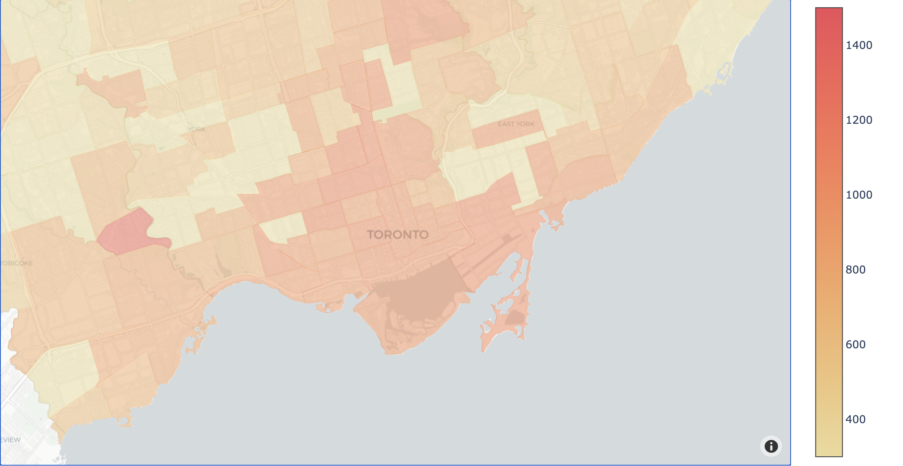

# Toronto-Condo-Price-Visualization
This project starts on 2020 COVID-19 pandemic period. As a melted pot city, Toronto real estate market is always booming, especially in downtown area. However, huge market change appears in 2020 due to more and more people move away from the downtown.

The motivation of the project is to create a systematic way to inspect Toronto Condo market. When I used third-party website to observe the market, such as Redfin, and zillow, I am not satisfied with provided functionality. The following key takeaways are what I am concerned at the beginning of the project:

* Create Toronto condo price map visualization.

* See the overall and accumulated market condition given a certain time period.
* Build a reliable pricing model for Toronto condo market.
* Create Toronto condo price prediction map visualization.
* Find more insights.

Click following url to continue

https://nbviewer.jupyter.org/github/jerrysun103/Toronto-Condo-Price-Visualization/blob/master/data_analysis.ipynb
